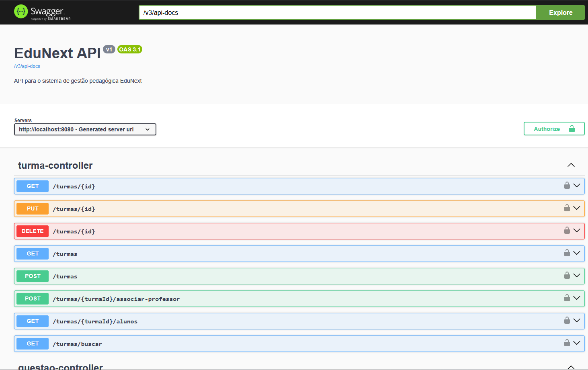
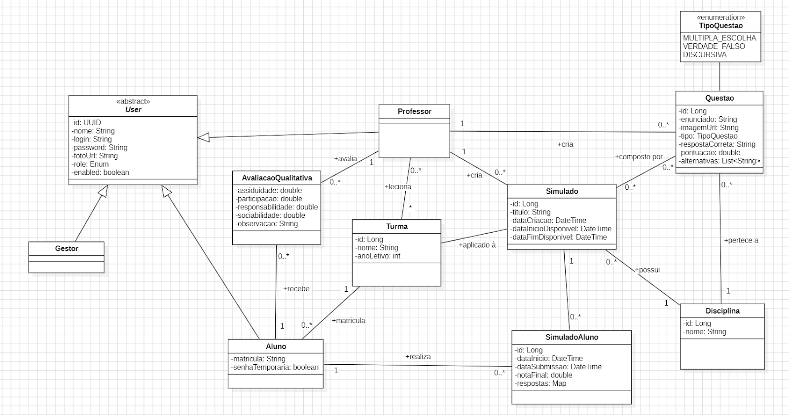

# 📚 EduNext API


> **Backend robusto para gestão escolar e aplicação de simulados gamificados.**

---

## O Que é o EduNext?

API RESTful desenvolvida para modernizar a gestão do colégio **Centro Educa Mais Viriato Corrêa**. O sistema gerencia o ciclo de vida acadêmico e possui um **motor de avaliação** capaz de gerar, aplicar e corrigir simulados automaticamente.

### Funcionalidades

*  **RBAC Seguro:** Autenticação via JWT com perfis (`GESTOR`, `PROFESSOR`, `ALUNO`).
*  **Simulados Dinâmicos:** Geração de provas randômicas e correção automática.
*  **Upload Cloud:** Integração com **AWS S3** para arquivos (Opcional).
*  **Qualidade:** Arquitetura em camadas, **Entity Graph** e Documentação via **Swagger**.

---

## Interface da API (Swagger UI)

A API é totalmente documentada. Abaixo, uma captura da interface do swagger que lista os endpoints.

<p align="center">
  
</p>

---

##  Modelagem de Dados

O projeto utiliza um modelo relacional robusto para garantir a integridade das avaliações.

<p align="center">
  
</p>

---

## Documentação Complementar

Além do código fonte, o projeto conta com uma documentação acadêmica detalhada disponível na pasta [`/docs`](./docs)

---

## Como Rodar (Quick Start)

Pré-requisitos: **Docker** e **Git**.

1.  **Clone o repositório:**
    ```bash
    git clone https://github.com/ismaelnetodev/projeto-edunext.git
    cd projeto-edunext/app
    ```

2.  **Configure o ambiente:**
    Crie o arquivo `.env` na pasta `app/` com os seguintes campos:
    ```ini
    PGUSER=user_db
    PGPASSWORD=senha_db
    PGDATABASE=edunext_db
    JWT_SECRET=seu_segredo_base64_aqui
    ADMIN_PASSWORD=admin123
    
    # AWS S3 (Opcional)
    AWS_ACCESS_KEY_ID=chave_de_acesso_aqui
    AWS_SECRET_ACCESS_KEY=chave_de_acesso_secreta
    AWS_REGION=us-east-1
    AWS_BUCKET_NAME=nome_bucket
    ```

3.  **Execute:**
    ```bash
    docker compose up -d --build
    ```

4.  **Acesse:**
    *  **API:** `http://localhost:8080`
    *  **Swagger UI:** `http://localhost:8080/swagger-ui/index.html`

---

## Testes Automatizados

Para executar a suíte de testes (Unitários e Integração) utilizando o banco em memória (H2):

```bash
# Dentro da pasta /app
./mvnw test
```
---

## Equipe

Projeto acadêmico desenvolvido pelos alunos:

* **[Ismael Neto](https://www.linkedin.com/in/ismaelcostaneto/)**
* **[Mariana Stephany](https://www.linkedin.com/in/mariaraujojc/)**
* **[Enzo Santiago](https://www.linkedin.com/in/enzo-santiago-ferreira-7ba742187/)**
* **[João Pedro](https://www.linkedin.com/in/jo%C3%A3o-pedro-barbosa-6403ab308/)**
* **[Grazielle Lima](#)**
* **[Maria Eduarda](#)**
* **[Josiel Ribeiro](#)**
* **[Heitor Wagner](#)**

---
<p align="center">
  <sub>Desenvolvido com ☕ e Java 21</sub>
</p>